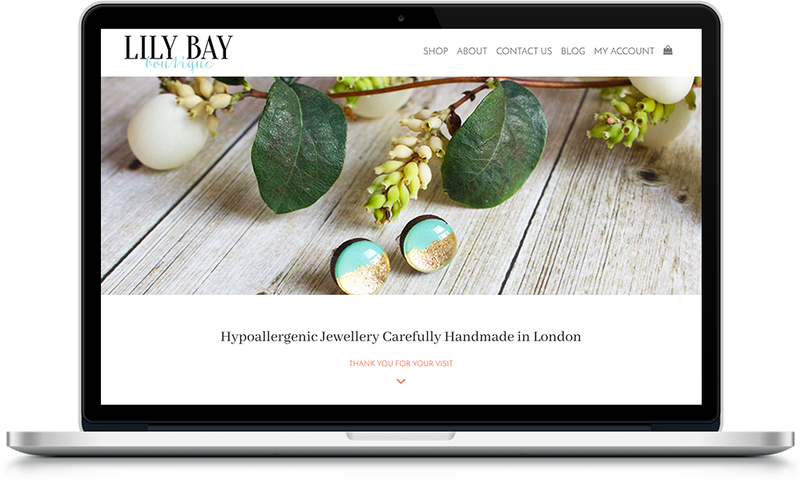

# LilyBayBoutique's Website

This is the custom WordPress theme with WooCommerce I built in 2018 for the LilyBayBoutique independent e-commerce store.

The technologies I have used are:

* PHP
* CSS
* JavaScript

## My contribution and what I have learned

* I discussed with the client how to build a Content Management System using WordPress and WooCommerce to add E-commerce functionality.
* I provided her with Laptop, mobile and tablet website mockups designed with Photoshop.
* I wrote the code to generate a responsive website, also using:
  * Bootstrap
  * Font Awesome
  * WordPress
  * WooCommerce

## Website Screenshots
<space><space>

### Laptop version

